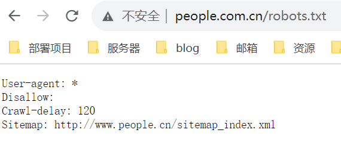

## 免责声明：
 - data文件夹中的文章仅做学习研究使用，如果侵权，请联系删除。
 - email: slience_me@foxmail.com

### 数据获取
数据获取过程严格遵循规定
> 
> 
> 这段文本是一个 robots.txt 文件的内容，用于指导网络爬虫（爬虫程序）在访问特定网站时应该遵循的规则。让我为你翻译一下：
>- User-agent: *（用户代理：*）
>  - 意味着适用于所有的网络爬虫。
>- Disallow: （不允许访问的路径）
>  - 在这里是空白的，表示没有特定路径是不允许访问的。也就是说，爬虫在此网站上没有被限制访问特定页面。
>- Crawl-delay: 120（爬行延迟：120）
>  - 表示网络爬虫应该在请求页面之间保持至少 120 秒的延迟，以减轻对服务器的负担。这有助于确保不会对服务器产生过多的请求负荷。
>- Sitemap: http://www.people.cn/sitemap_index.xml（站点地图）
>  - 这是站点地图的 URL，提供了有关网站中可用页面的信息。网络爬虫可以使用这个站点地图来更有效地索引网站的内容。
>总的来说，这个 robots.txt 文件允许所有的网络爬虫访问这个网站的所有页面，但要求它们之间至少保持 120 秒的爬行延迟，以降低对服务器的压力。站点地图的 URL 也提供了关于网站内容的索引信息。

### 人民日报版权声明内容
官网： http://paper.people.com.cn/

> 《人民日报》（电子版）的一切内容(包括但不限于文字、图片、PDF、图表、标志、标识、商标、版面设计、专栏目录与名称、内容分类标准以及为读者提供的任何信息)仅供人民网读者阅读、学习研究使用，未经人民网股份有限公司及/或相关权利人书面授权，任何单位及个人不得将《人民日报》（电子版）所登载、发布的内容用于商业性目的，包括但不限于转载、复制、发行、制作光盘、数据库、触摸展示等行为方式，或将之在非本站所属的服务器上作镜像。否则，人民网股份有限公司将采取包括但不限于网上公示、向有关部门举报、诉讼等一切合法手段，追究侵权者的法律责任。